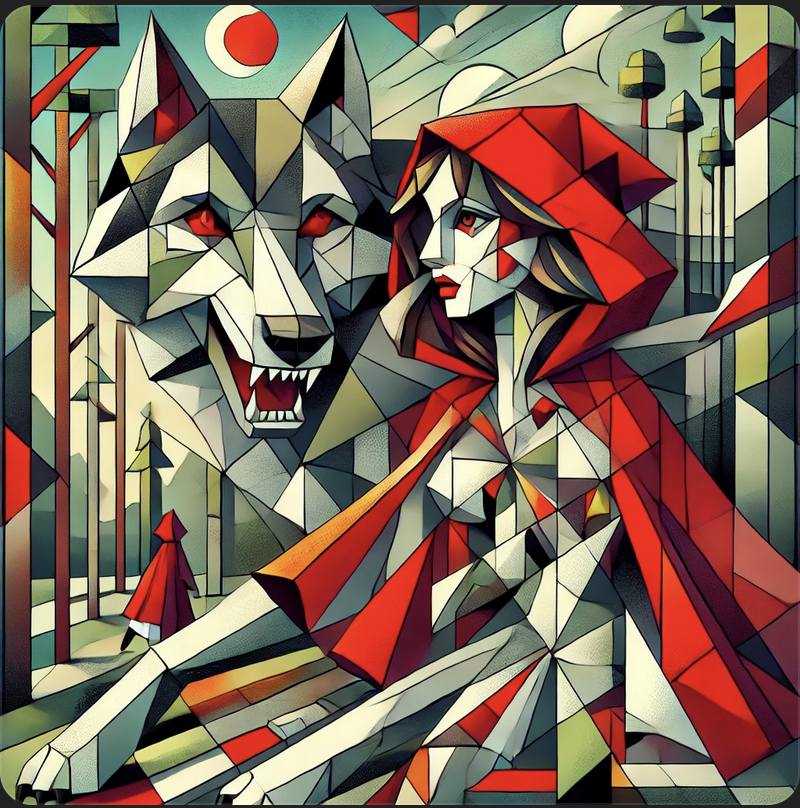
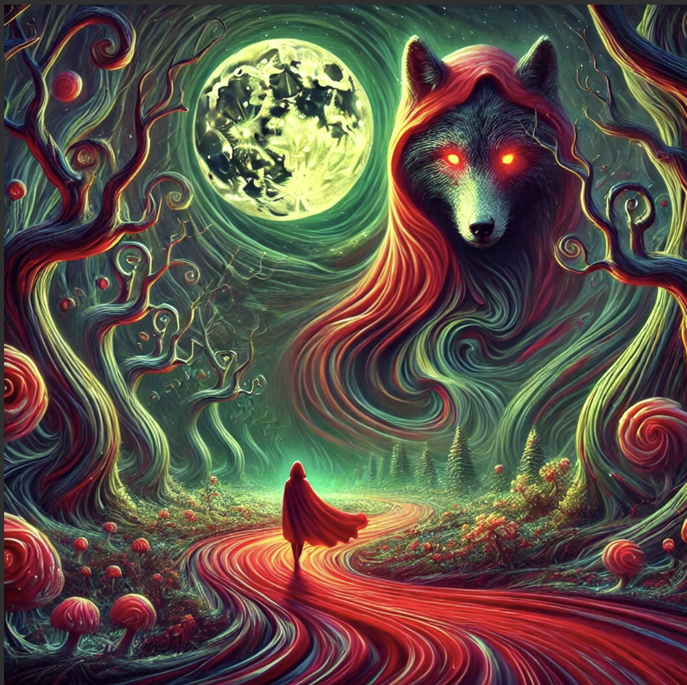

# Neural Painter: AI-Generated Art from Stories & Poems

# Project Description

**Neural Painter** is an AI-powered application that converts poems, short stories, or descriptive text into dramatic paintings in user-preferred artistic styles. Using natural language processing (NLP) and text-to-image neural networks, this project seeks to make literature come alive as visual art.

It will look for key themes, emotions, and imagery in the input text and create a painting based on the mood and content of the text. Also, **the selection of an artistic style** can be made, such as Impressionism, Gothic, Watercolor, and Surrealism, in order to set the style of their piece of artwork. 

In this project, **language, creativity, and machine learning meet** and provide an incredible new way to illustrate stories and poems. It would implement advanced deep learning models to not only change textual descriptions into images but also adopt color palettes, patterns of brushstrokes, and techniques of composition appropriate for the selected style of art. Users can easily experiment with different interpretations of their text, seeing how AI understands and represents their words in various visual forms.

Besides, Neural Painter can be a powerful tool for **writers, educators, and artists**. It can allow writers to visualize their stories as digital paintings, educators to use it in illustrating concepts in literature, and artists to experiment with AI-generated inspirations for their work. This project also has the potential to **enhance digital storytelling** by allowing creators to generate illustrated versions of their written content with ease.

## Why is this project exciting?

- Bridges **literature, art, and AI** in a unique way.
- Explores how AI interprets **stories as visual elements**.
- Encourages creative expression and introduces **artificial intelligence-generated art**.
- A practical tool for **writers, educators, and artists**.
- Showcases the evolving capabilities of **text-to-image AI** in creative applications.

## What does success look like?

- The AI will correctly extract what are the **key visual elements** of the given text.
- The paintings will then correctly represent or **visually represent the theme** of the story.
- Users interact with a simple web interface where they can choose various artistic styles.
- The model will successfully change its visual output concerning textual input and the style chosen by a particular user.
- The system is running efficiently, providing high-quality images in a decent amount of time.

## Project Goals

1. **NLP Model** development aimed at extracting main imagery from text.
2. **Training of Text-to-Image AI** to generate paintings (Stable Diffusion, DALL·E).
3. **Style Transfer**: The user is allowed to choose an artistic style to apply.
4. **Web-Based Interface**: The user can provide text input and generate paintings.
