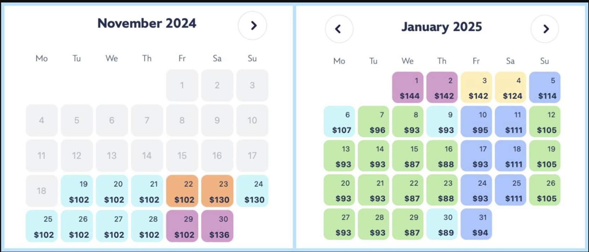

# Dynamic Pricing for Sports & Concert Tickets

## **Project Description**
This project proposes a **Reinforcement Learning (RL) and Neural Network-based dynamic pricing model** for sports and concert ticketing. The goal is to optimize ticket prices based on real-time demand, consumer behavior, and external factors, ensuring maximum revenue while maintaining fair pricing. 

### **What are you planning to do?**
We plan to develop an **AI-driven pricing model** using **Reinforcement Learning (RL) and Neural Networks** to dynamically adjust ticket prices. The system will analyze historical ticket sales, competitor pricing, event popularity, and real-time market demand to optimize pricing strategies. This model will leverage **deep learning architectures** to forecast demand trends and apply **adaptive price adjustments** based on current conditions, ensuring both high revenue and accessibility to fans. 

### **Why is your project exciting/fun/educational?**
This project is exciting because it bridges the fields of **machine learning, economics, and analytics** to revolutionize ticket pricing strategies. It is fun because it allows for experimentation with real-world event data and the challenge of designing fair yet revenue-maximizing pricing policies. 

### **What does success look like?**
Success will be defined by:
- The RL model **accurately predicting demand fluctuations** and adjusting prices dynamically to match consumer behavior.
- Maximizing shareholder value and profitability without alienating customers, ensuring ticket affordability while maximizing profit margins.
- An ethical and fair pricing mechanism that **avoids extreme price surges**, ensuring customer trust and long-term engagement.

## **Project Goals**
1. **Develop an RL-based pricing strategy** that adapts to real-time data, ensuring optimal price adjustments.
2. **Implement a demand prediction model** using Neural Networks to forecast ticket sales and optimize pricing strategies.
3. **Optimize revenue generation** while maintaining consumer engagement, striking a balance between profitability and accessibility.
